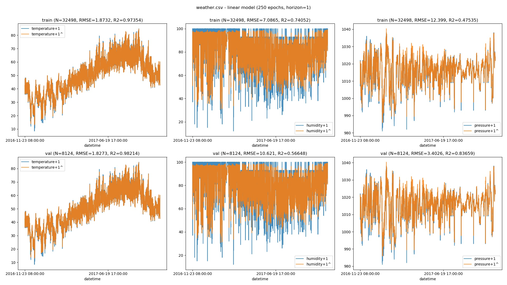
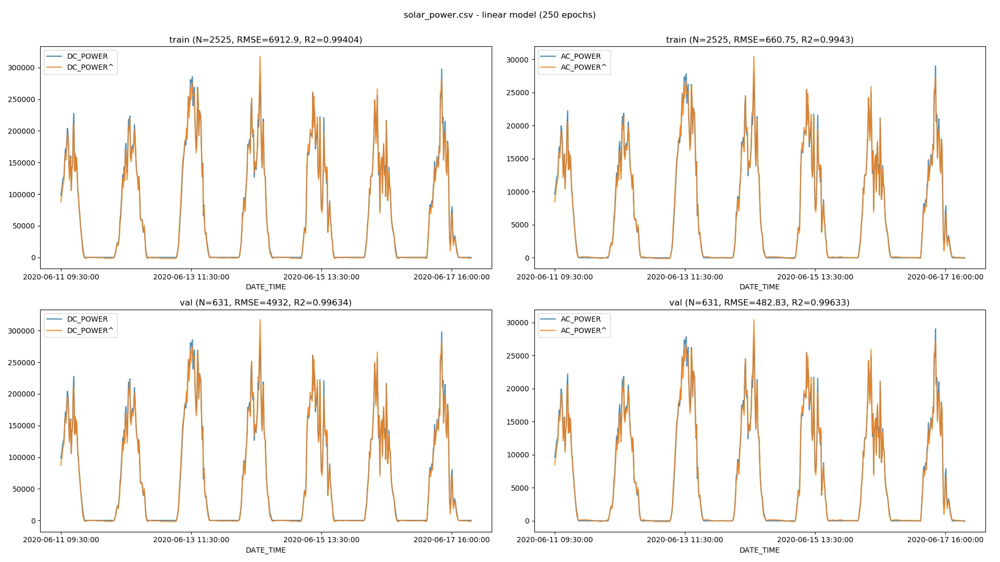

# pytorch-timeseries

Time-series forecasting and prediction on tabular data using PyTorch.  Supports Jetson Nano, TX1/TX2, AGX Xavier, and Xavier NX.

#### Starting the Container

``` bash
$ git clone https://github.com/dusty-nv/pytorch-timeseries
$ cd pytorch-timeseries
$ docker/run.sh
$ cd pytorch-timeseries
```

#### Weather Forecasting

In this [hourly weather dataset](https://www.kaggle.com/selfishgene/historical-hourly-weather-data), we are forecasting the future weather of a city based on it's past weather.  The following data is given on 1-hour intervals:

```
temperature
humidity
pressure
wind_direction
wind_speed
```

Start by forecasting just the temperature:

``` bash
$ python3 train.py --data data/weather.csv --inputs temperature --outputs temperature --horizon 1

train RMSE: [1.7638184641368702]
train R2:   [0.9768890819461414]

val RMSE:   [1.788160646675811]
val R2:     [0.9815134518452414]
```


Next we can incorporate multiple inputs and outputs by simultaneously predicting the temperature, humidity, and barometric pressure:

``` bash
$ python3 train.py --data data/weather.csv --inputs temperature,humidity,pressure --outputs temperature,humidity,pressure --horizon 1

train RMSE: [1.8732083404885846, 7.086468834684506, 12.398559674547002]
train R2:   [0.9735385787621987, 0.7405181652792221, 0.4753518787407489]

val RMSE:   [1.8272543024543522, 10.621018369410514, 3.4025864627892943]
val R2:     [0.9821397234156162, 0.5664843260674557, 0.8365918355499764]
```



#### Solar Power Prediction

This [dataset](https://www.kaggle.com/anikannal/solar-power-generation-data) contains solar panel power generation data along with environmental conditions from a solar power plant.  The goal is to predict generated power given sthe ambient temperature and amount of sunlight.  In this example, we are predicting 2 outputs (AC and DC power)

``` bash
$ python3 train.py --data data/solar_power.csv --inputs AMBIENT_TEMPERATURE,IRRADIATION --outputs DC_POWER,AC_POWER

train RMSE: [6912.877912624019, 660.7508599953275]
train R2:   [0.9940444439752174, 0.9942998898150646]

val RMSE:   [4932.04556598682, 482.82950183757634]
val R2:     [0.9963377448275983, 0.9963286618121212]
```



#### Space Shuttle Classification

This classification dataset from the [UCI Machine Learning Repository](https://archive.ics.uci.edu/ml/datasets/Statlog+%28Shuttle%29) contains the values from 9 sensors and has 7 state classes:

```
class distribution:
  [0] 'Rad Flow' - 45586 samples
  [1] 'Fpv Close' - 50 samples
  [2] 'Fpv Open' - 171 sampless
  [3] 'High' - 8903 samples
  [4] 'Bypass' - 3267 samples
  [5] 'Bpv Close' - 10 samples
  [6] 'Bpv Open' - 13 samples

total:  58000 samples
```

The goal is to predict the state of the system from the current sensor data.  Given the unbalanced distribution of data between the classes, this example is akin to anomoly detection.

``` bash
$ python3 train.py --data data/shuttle.csv --inputs 0,1,2,3,4,5,6,7,8 --outputs class --classification --epochs 100

train accuracy:  [0.9995689655172414]
train precision: [0.9995585721164452]
train recall:    [0.9995689655172414]
train F1:        [0.9995573360381868]

val accuracy:    [0.9987068965517242]
val precision:   [0.9987528787795457]
val recall:      [0.9987068965517242]
val F1:          [0.9986359711781727]
```